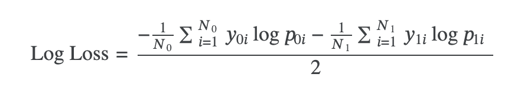

### Project details
The goal is to predict if a person has any of three medical conditions. You are being asked to predict if the person has one or more of any of the three medical conditions (Class 1), or none of the three medical conditions (Class 0). You will create a model trained on measurements of health characteristics.

### Test set
For each id in the test set, you must predict a probability for each of the two classes. The file should contain a header and have the following format:
Id,class_0,class_1
00eed32682bb,0.5,0.5
010ebe33f668,0.5,0.5
02fa521e1838,0.5,0.5
040e15f562a2,0.5,0.5
046e85c7cc7f,0.5,0.5
...

### Data
#### train.csv - The training set.
Id Unique identifier for each observation.
AB-GL Fifty-six anonymized health characteristics. All are numeric except for EJ, which is categorical.
Class A binary target: 1 indicates the subject has been diagnosed with one of the three conditions, 0 indicates they have not.

#### test.csv - The test set.
Your goal is to predict the probability that a subject in this set belongs to each of the two classes.

#### sample_output.csv
A sample output file in the correct format.

### Evaluation of result
Result is evaluated using a _balanced logarithmic loss_. The overall effect is such that each class is roughly equally important for the final score.

Each observation is either of class 0 or of class 1. For each observation, you must submit a probability for each class. The formula is then:

where (N_{c}) is the number of observations of class (c), (\log) is the natural logarithm, (y_{c i}) is 1 if observation (i) belongs to class (c) and 0 otherwise, (p_{c i}) is the predicted probability that observation (i) belongs to class (c).
